- Kustomize comes built-in with kubectl so no other package needs to bs installed.

Commands:

kustomize version --short
kustomize build k8s/ --> provide the whole folder

folder looks likke
k8s
|-- nginx-deploy.yaml
|-- nginx-service.yaml
|-- kustomization.yaml   --> This is mandatory and it should be the same name 

kustomization.yaml
apiVersion: kustomize.config.k8s.io/v1beta  # this feild is optional you can define it. ot if you not define it then it will fetch automatically
kind: Kustomization     # This is the same as the apiVersion

# kubernetes resources to be managed by kustomize
resources:
    nginx-deploy.yaml
    nginx-service.yaml

# Customization that need to be made
commonLabels:
    company: anything

- Kustomize looks for a kustomization file which contains:
    List of all the k8s manifest kustomize should be manage
    All of the customiations that should be applied

- The 'kustomize build k8s/' command combined all the manifest and applies the defined transformations.
- The 'kustomize build' command does not apply/deploy the k8s resources to a cluster
    The output needs to redirected to the 'kubectl apply' command

# The below ways we can apply the kustomizarion
1st way -> kustomize build k8s/ | kubectl apply -f -  
2nd way -> kubectl apply -k k8s/

## To delete it
1st way -> kustomize build k8s/ | kubectl delete -f - 
2nd way -> kubect delere -k k8s/

# Common Transformation
- commonLabel - adds a label to all k8s resources

- namePrefix/Suffix - adds a common prefix-suffix to all resource names

- Namespaces - adds a common nd to all resources
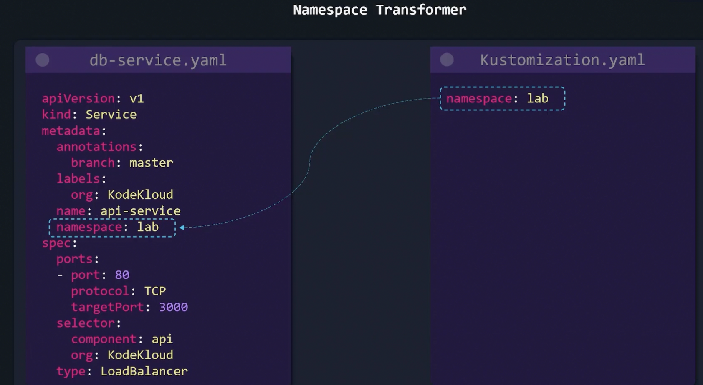

- commonAnnotations - 

# Image Transformer
1. 

2. 

# Patches
- Kustomize patches provide another method to modifying kubernetes configs
- Patches provides a more surgical approch to targeting one or more specific section in kubernetes resources
- To create a patch 3 parameter must be provided:
    - Operation Type: add/remove/replace
    - Target: In which resource patch apply
        - kind
        - Version/Group
        - Name
        - Namespace
        - labelSelector
        - AnnotationSelector
    - Value: What is the value that will either be replaced or added with. (only need for add/replace operations)
    
    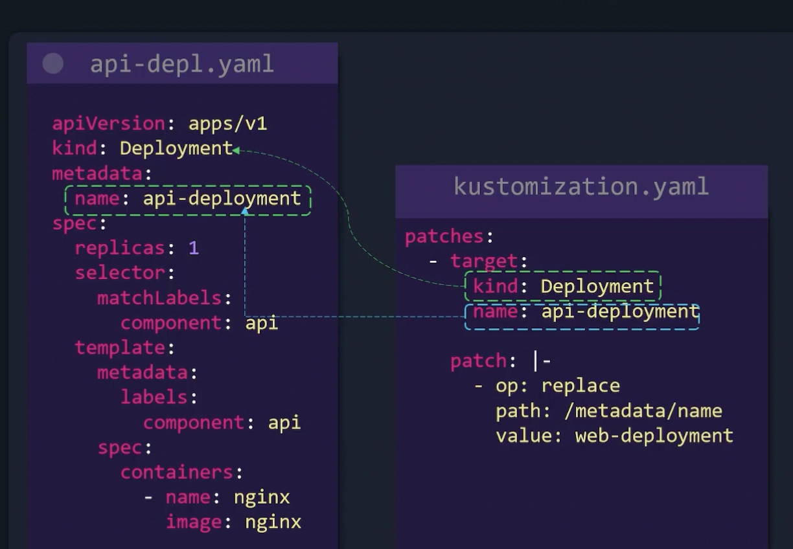

    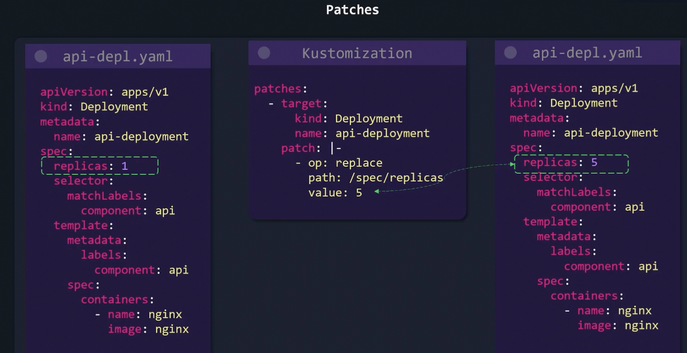

    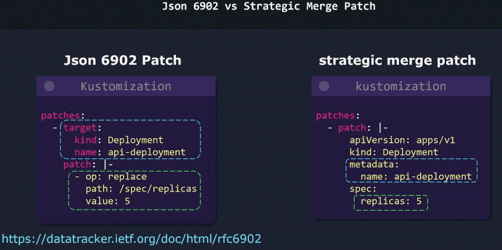

    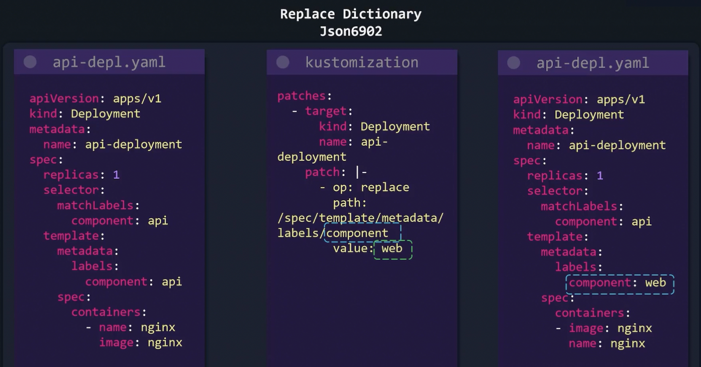 
    
    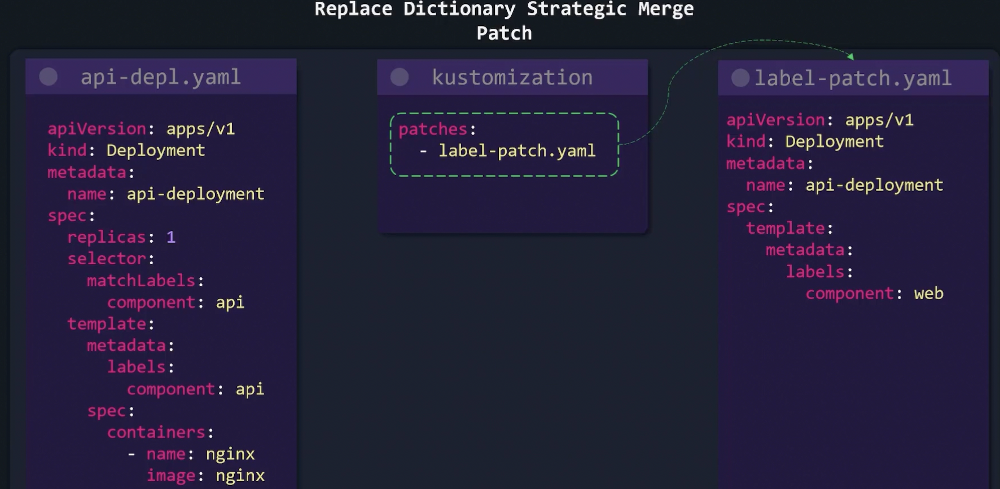

    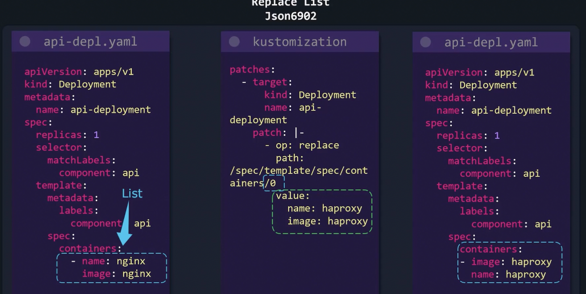

    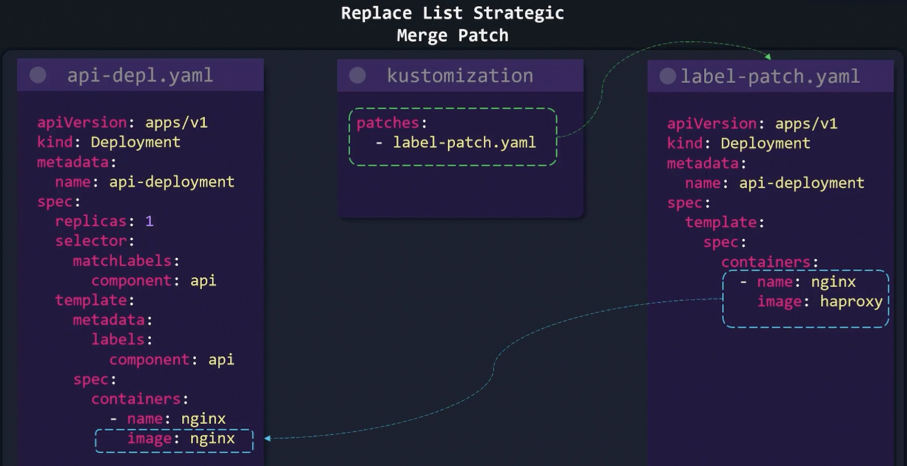

    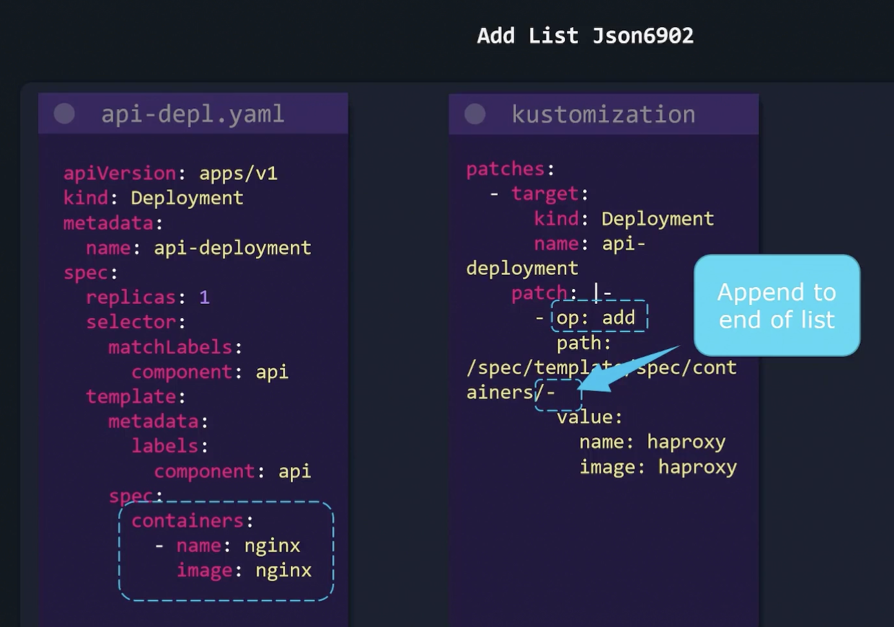

    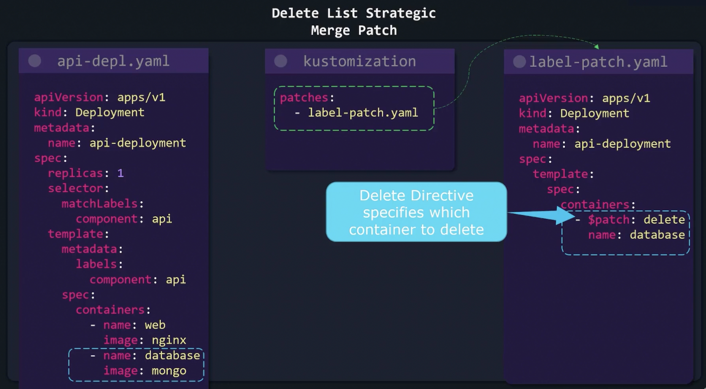

# Overlays
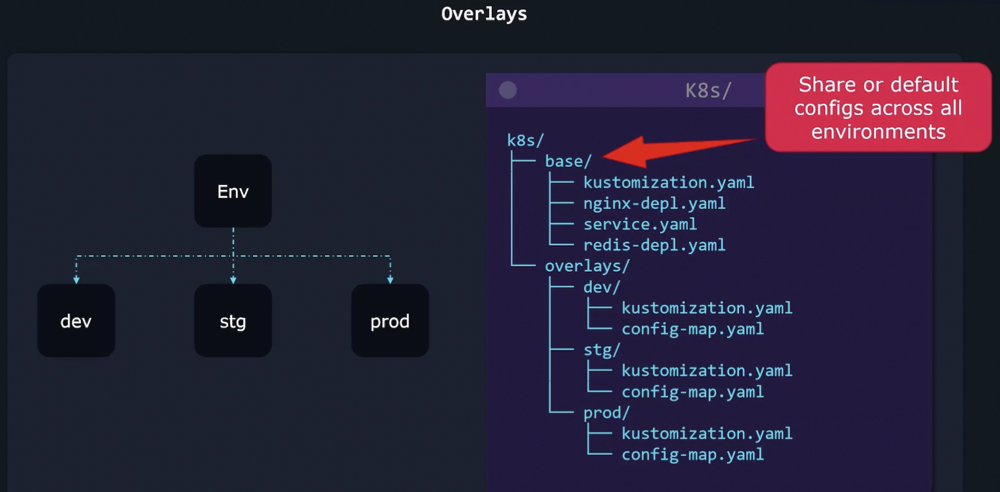

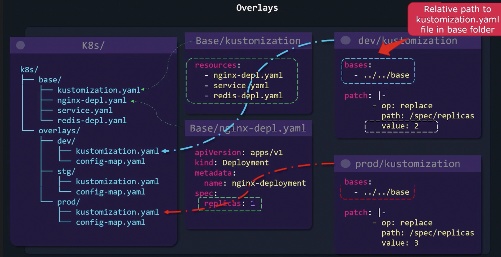

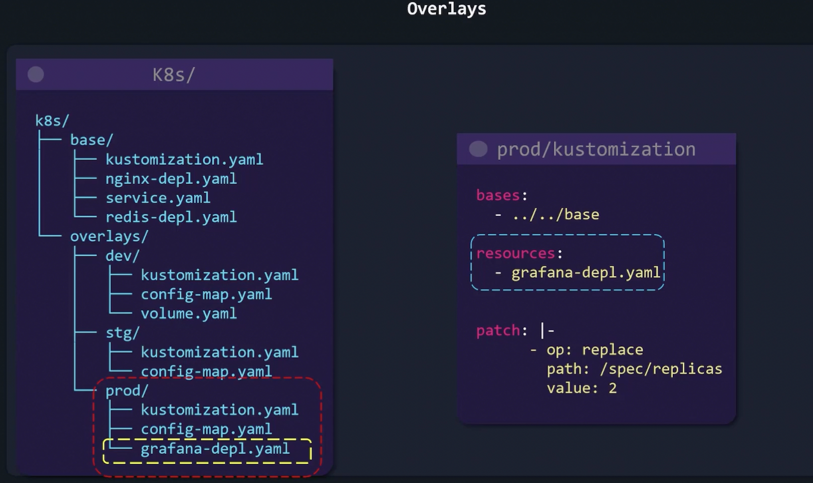

# Components

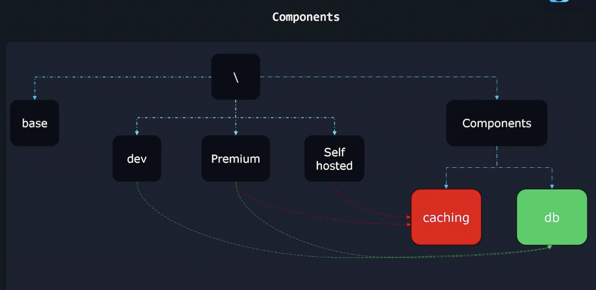